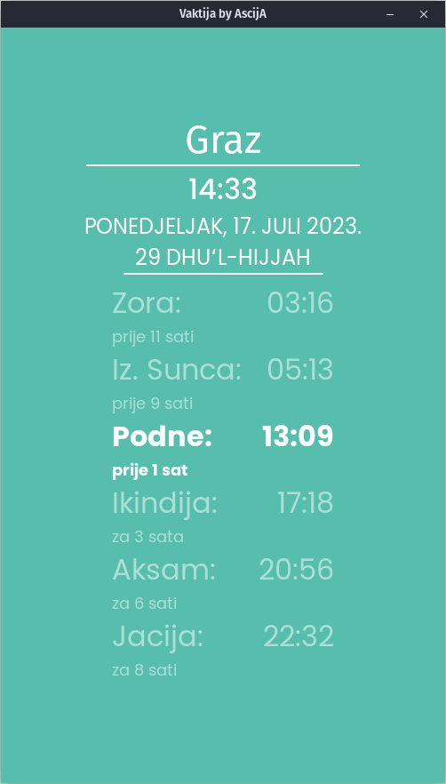

# ba.ascija.vaktija

Unofficial port of [Vaktija.eu](https://vaktija.eu/) for desktop written in Tauri/ReactJS.

  
## License

This program is licensed under the GNU General Public License version 3.0. For more details, please see the [GNU General Public License](http://www.gnu.org/licenses/) page.

## Optional Requirements
- [Poppins Font](https://fonts.google.com/specimen/Poppins)
  
## Installation 
#### Linux
Download the binary. Run `sudo apt install vaktija_*.deb`.  
Or alternatively use the provided AppImage.
#### Windows 
Download the installer and run it.
#### MacOS
See [Build from source](#building-from-source)

## Building from source 

#### Prerequisites
[Tauri v1.4](https://tauri.app/v1/guides/getting-started/prerequisites)
[NodeJS v16](https://nodejs.org/)
Other dependencies should be automatically installed upon building.

#### Build Process
Run the `npm run tauri build` command. The binaries will be placed in `src-tauri/target/release`
## Acknowledgements

This application is inspired by [Vaktija.eu](https://vaktija.eu/) and [Vaktija.ba](https://vaktija.ba/).
Vectors and icons inpired by [SVGRepo](https://www.svgrepo.com/svg/48266/muslim-man-praying).

## Contact

For any questions, feedback, feature request or bugs please submit an issue.  

## Notice

This project is following the **Atwood's law** which states: 
> Any application that can be written in JavaScript, will eventually be written in JavaScript. :rofl: :rofl:
